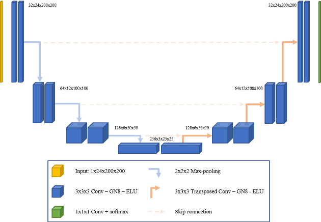

https://www.kaggle.com/code/faressayah/chest-x-ray-medical-diagnosis-with-cnn-densenet/comments

# 1. Overview
This repository is an exercise in image segmentation using lung images as the dataset. 

Medical Image Segmentation is the process of automatic detection of boundaries within images. In this exercise, I train a convolutional neural network with [U-Net](https://arxiv.org/abs/1505.04597) architecture.




Inspiration for lung segmentation project was taken from this (notebook)[https://www.kaggle.com/code/eduardomineo/u-net-lung-segmentation-montgomery-shenzhen]

U-net model was adapted from this this (blog post)[https://towardsdatascience.com/creating-and-training-a-u-net-model-with-pytorch-for-2d-3d-semantic-segmentation-model-building-6ab09d6a0862]

This project was undertaken with the goal of presenting to the Deep Learning Community associated with Deci.ai.  However, it is also a reflection of my interest in CV and building up an image segmentation task from scratch.

# 1. Installation

1. Set up a new environment with an environment manager (recommended):
   1. [conda](https://docs.conda.io/en/latest/miniconda.html):
      1. `conda create --name unet-lung -y`
      2. `conda activate unet-lung`
      3. `conda install python=3.10 -y`
   2. [venv](https://docs.python.org/3/library/venv.html):
      1. `python3 -m venv unet-lung`
      2. `source unet-lung/bin/activate`
2. Install the libraries:
  1. conda
```
conda install -c conda-forge pytorch-model-summary
```


  2. venv
    `pip install -r requirements.txt`
3. Start a jupyter server or run in VS code:
`jupyter-notebook` OR `jupyter-lab`

**Note**: This will install the CPU-version of torch. If you want to use a GPU or TPU, please refer to the instructions on the [PyTorch website](https://pytorch.org/)


# 3. Data Preparation

1. Combine left and right lung segmentation masks of Montgomery chest x-rays
1. Resize images to 512x512 pixels
1. Split images into training and test datasets
1. Write images to /segmentation directory

# 4. Training
1. Trainer class implements the training loop
2. Loss Function: (dice coefficient)[https://towardsdatascience.com/biomedical-image-segmentation-u-net-a787741837fa#:~:text=Dice%20coefficient,-A%20common%20metric&text=The%20calculation%20is%202%20*%20the,denotes%20perfect%20and%20complete%20overlap]

# 5. Test
1. Inferencer class implements the test phase

# 6. Deployment

## Kaggle

1. Link github repo to kaggle and it appears in `/kaggle/working`.
2. Add it to the path and then can use it as a custom library from your notebook

## AWS

(uploading data to s3)[https://medium.com/@antonysruthy11/loading-kaggle-dataset-to-aws-s3-using-boto3-50af3e015fb2]

(also uploading to s3)[https://siddiqss.medium.com/how-to-extract-a-large-dataset-from-zip-file-on-aws-s3-easy-way-dc5aefb0257]

# Performance

On Kaggle, using 2 GPUs
- Loading/Processing images: 15 minutes
- 10 epochs: 20 minutes
Results
```
training_losses [0.6652035884192733, 0.6509182081847894, 0.6354550338182293, 0.6236948776440542, 0.6089722454303601, 0.5792451739066937, 0.5660596698766849, 0.5619621642056059, 0.557032078260281, 0.5573165591378682]
validation_losses [0.6562871727787081, 0.6357339552191438, 0.6304532914865212, 0.6275744936505302, 0.6001597838323625, 0.603246518822967, 0.7066250980877485, 0.6019600405067694, 0.5987570065943921, 0.5780486689239251]
```


# Finally. Learning
1. The data/image manipulation had a higher learning curve than expected.  Mixing image libraries led to unexpected formatting and some learning.
1. Best way to train/deploy model with large dataset
1. Interactions between jupyter notebook and code modules
-- Auto reload of changes within your modules can be enabled with this

[Reference](https://bobbyhadz.com/blog/jupyter-notebook-reload-module#:~:text=Use%20the%20%25load_ext%20autoreload%20magic,before%20executing%20the%20Python%20code.)
```
%load_ext autoreload
%autoreload 2

```
